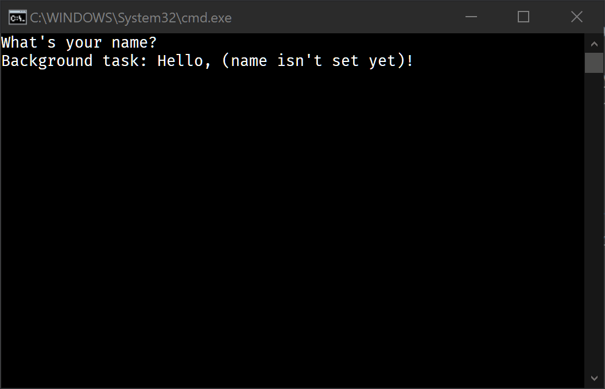

Welcome to a collection of samples for [Stl.Fusion]!

> All project updates are published on our [Discord Server]; it's also the best place for Q/A.\
> 

## What's Inside?

### 1. HelloWorld

Fusion-style [HelloWorld](src/HelloWorld) shows how to create
simple dependency chains and and react to invalidation events. 
[Its Program.cs](src/HelloWorld/Program.cs) is just about 40 lines long.

### 2. HelloBlazorServer

[HelloBlazorServer](src/HelloBlazorServer) is a default Blazor Server App 
modified to reveal some Fusion powers. Contrary to the original app:
* It displays changes made to a *global* counter in real-time
* Similarly, it updates weather forecasts in real-time
* A new "Simple Chat" sample shows a bit more complex update scenario and
  features a simple chat bot.

If you're curious how big is the difference between the code of
these samples and a similar code without any real-time
features, 
[check out this part of Stl.Fusion README.md](https://github.com/servicetitan/Stl.Fusion#enough-talk---lets-fight-show-me-the-code).

### 3. Blazor Samples

It's a dual-mode [Blazor](https://docs.microsoft.com/en-us/aspnet/core/blazor/hosting-models?view=aspnetcore-3.1) SPA hosted by
[ASP.NET Core](https://dotnet.microsoft.com/apps/aspnet) website,
which also serves its API. The application includes:
* "Server Time" and "Server Screen" pages showing the simplest timeout-based invalidation
* "Chat" - a tiny chat relying on event-based invalidation
* "Composition" shows Fusion's ability to use both  local `IComputed<T>` instances 
  and client-side replicas of similar server-side instances to compute a new value
  that properly tracks both local and remote dependencies.

Note that "Composition" sample shown in a separate window in the bottom-right corner
also properly updates everything. It shows Fusion's ability to use both local `IComputed<T>` 
instances and client-side replicas of similar server-side instances to compute a new value
that properly tracks all these dependencies and updates accordingly: 
* First panel's UI model is 
  [composed on the server-side](https://github.com/servicetitan/Stl.Fusion.Samples/blob/master/src/Blazor/Server/Services/ComposerService.cs);
  its client-side replica is bound to the component displaying the panel
* And the second panel uses an UI model
  [composed completely on the client](https://github.com/servicetitan/Stl.Fusion.Samples/blob/master/src/Blazor/Client/Services/LocalComposerService.cs) 
  by combining server-side replicas of all the values used there.
* **The surprising part:** two above files are almost identical!

The sample supports **both (!)** Server-Side Blazor and Blazor WebAssembly modes &ndash;
you can switch the mode on its "Home" page.

Moreover, it also exposes a regular RESTful API &ndash;
try invoking any of endpoints there right from embedded Swagger console.

### 4. Tutorial

It's interactive &ndash; you can simply [browse it](docs/tutorial/README.md), but to
modify and run the C# code presented there, you need
[Try .NET](https://github.com/dotnet/try/blob/master/DotNetTryLocal.md)
or [Docker](https://www.docker.com/).

## Running Samples

Build & run locally with [.NET Core SDK 3.1](https://dotnet.microsoft.com/download):

| Sample | Command |
|-|-|
| [HelloWorld] | `dotnet run -p src/HelloWorld/HelloWorld.csproj` |
| [HelloBlazorServer] |  `dotnet run --project src/HelloBlazorServer/HelloBlazorServer.csproj` + http://localhost:5000/ |
| [Blazor Samples] |  `dotnet run --project src/Blazor/Server/Server.csproj` + http://localhost:5005/ |
| [Tutorial] | [Install Try .NET (preview version)](https://github.com/dotnet/try/blob/master/DotNetTryLocal.md) + `dotnet try --port 50005 docs/tutorial` |

Build & run with [Docker](https://docs.docker.com/get-docker/) + 
[Docker Compose](https://docs.docker.com/compose/install/):

| Sample | Command |
|-|-|
| [HelloWorld] | `docker-compose run sample_hello_world dotnet Samples.HelloWorld.dll` |
| [HelloBlazorServer] | `docker-compose up --build sample_hello_blazor_server` + http://localhost:5000/ |
| [Blazor Samples] | `docker-compose up --build sample_blazor` + http://localhost:5005/ |
| [Tutorial] | `docker-compose up --build tutorial` + https://localhost:50005/README.md |

## Useful Links

* Check out [Stl.Fusion repository]
* Go to [Documentation Home]
* Join our [Discord Server] to ask questions and track project updates.

**P.S.** If you've already spent some time learning about Stl.Fusion, 
please help us to make it better by completing [Stl.Fusion Feedback Form] 
(1&hellip;3 min).

[Stl.Fusion]: https://github.com/servicetitan/Stl.Fusion
[Stl.Fusion repository]: https://github.com/servicetitan/Stl.Fusion

[HelloWorld]: src/HelloWorld
[HelloBlazorServer]: src/HelloBlazorServer
[Blazor Samples]: src/Blazor
[Tutorial]: docs/tutorial/README.md
[Documentation Home]: https://github.com/servicetitan/Stl.Fusion/blob/master/docs/README.md

[Compute Services]: https://github.com/servicetitan/Stl.Fusion.Samples/blob/master/docs/tutorial/Part01.md
[Compute Service]: https://github.com/servicetitan/Stl.Fusion.Samples/blob/master/docs/tutorial/Part01.md
[`IComputed<T>`]: https://github.com/servicetitan/Stl.Fusion.Samples/blob/master/docs/tutorial/Part02.md
[Computed Value]: https://github.com/servicetitan/Stl.Fusion.Samples/blob/master/docs/tutorial/Part02.md
[Live State]: https://github.com/servicetitan/Stl.Fusion.Samples/blob/master/docs/tutorial/Part03.md
[Replica Services]: https://github.com/servicetitan/Stl.Fusion.Samples/blob/master/docs/tutorial/Part04.md
[Stl.Fusion In Simple Terms]: https://medium.com/@alexyakunin/stl-fusion-in-simple-terms-65b1975967ab?source=friends_link&sk=04e73e75a52768cf7c3330744a9b1e38
[Discord Server]: https://discord.gg/EKEwv6d
[Stl.Fusion Feedback Form]: https://forms.gle/TpGkmTZttukhDMRB6
