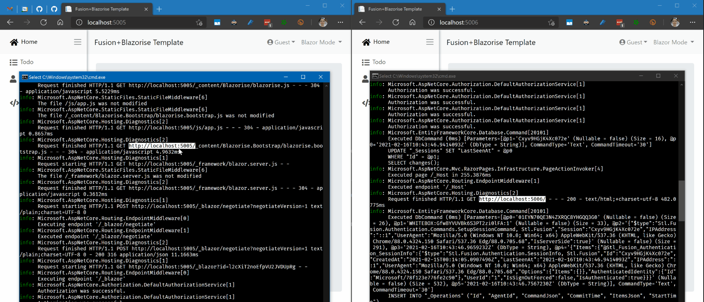
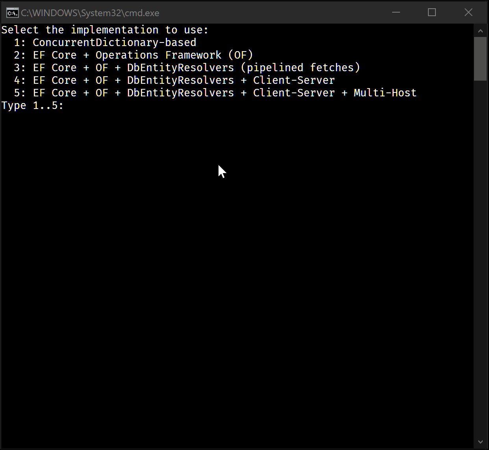
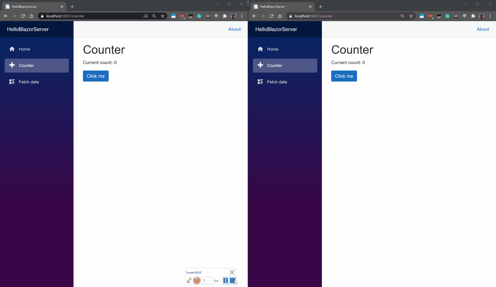
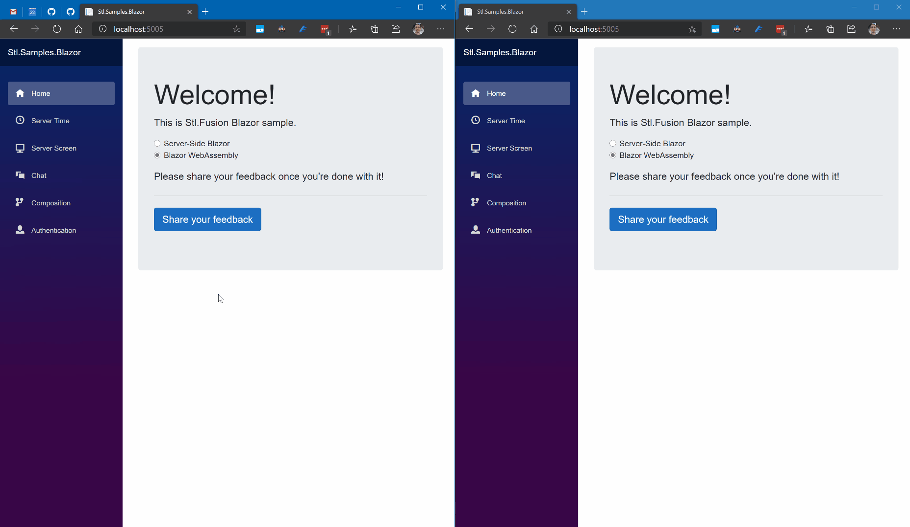
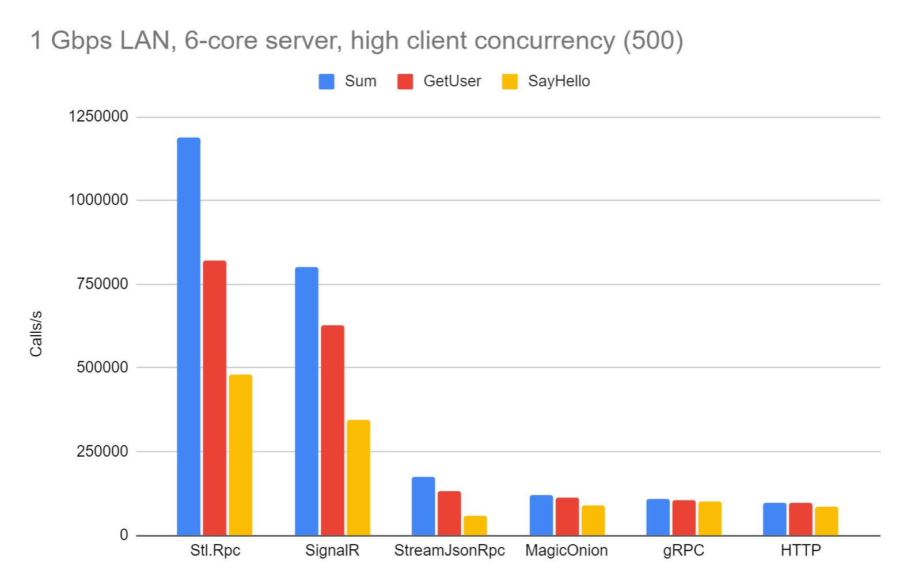
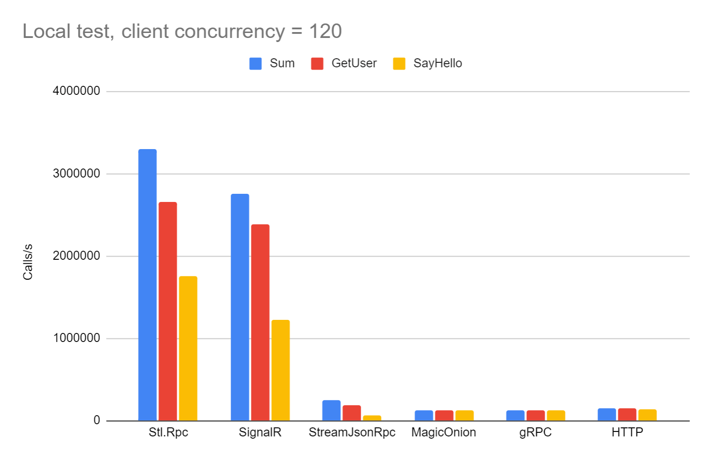

Welcome to a collection of [Fusion] samples!

> All project updates are published on its [Discord Server]; it's also the best place for Q/A.\
> [](https://github.com/servicetitan/Stl.Fusion.Samples/actions?query=workflow%3A%22Build%22)
> [](https://discord.gg/EKEwv6d)  

## What's Inside?

 This description is slightly outdated - we've added a few more samples with Fusion v6.1 release.

### 0. Solution Templates

We don't provide `dotnet new`-based templates yet, but you can find
template solutions to copy in [`templates/*` folders](https://github.com/servicetitan/Stl.Fusion.Samples/blob/master/templates).



Templates are also included into `Samples.sln`, so you can
try any of them by opening this solution & running one of 
template `.csproj` files.

### 1. HelloCart and HelloWorld Samples



 [HelloCart] 
is a small console app designed to show how to implement a simple 
Fusion API by starting from a toy version of it
and gradually transition to its production-ready version
that uses EF Core, can be called remotely, and scales 
horizontally relying on multi-host invalidation.

["QuickStart: Learn 80% of Fusion by walking through HelloCart sample"](./tutorial/QuickStart.md) is the newest part of [Fusion Tutorial] that covers
specifically this sample. Check it out!

And [HelloWorld] shows how to create
an incremental build simulation on Fusion. Nothing is really 
built there, of course - the goal is to shows how Fusion
"captures" dependencies right when you use them and runs
cascading invalidations.

If you're choosing between `HelloWorld` and `HelloCart` - 
play with `HelloCart` first. It is also a sample covered
in [QuickStart part](tutorial/QuickStart.md) 
of the [Fusion Tutorial].

### 2. HelloBlazorServer and HelloBlazorHybrid Samples

[HelloBlazorServer] is the default Blazor Server App 
modified to reveal some Fusion powers. Contrary to the original app:
* It displays changes made to a *global* counter in real-time
* Similarly, it updates weather forecasts in real-time
* A new "Simple Chat" sample shows a bit more complex update scenario and
  features a simple chat bot.



If you're curious how big is the difference between the code of
these samples and a similar code without any real-time
features, 
[check out this part of Fusion README.md](https://github.com/servicetitan/Stl.Fusion#enough-talk-show-me-the-code).

[HelloBlazorHybrid] is the same sample, but modified to support both
Blazor Server and Blazor WebAssembly modes.

### 3. Blazor Samples

 Play with [live version of this app](https://fusion-samples.servicetitan.com) right now!

It's a dual-mode [Blazor](https://docs.microsoft.com/en-us/aspnet/core/blazor/hosting-models?view=aspnetcore-3.1) SPA hosted by
[ASP.NET Core](https://dotnet.microsoft.com/apps/aspnet) website,
which also serves its API. The application includes:
* "Server Time" and "Server Screen" pages showing the simplest timeout-based invalidation
* "Chat" &ndash; a tiny chat relying on event-based invalidation
* "Composition" shows how Fusion tracks and updates a complex state built 
  from the output of [Compute Services] (local producers) and 
  [Replica Services] (remote producers)
* "Authentication" &ndash; a GitHub authentication sample with Google-style real-time 
  session tracking, "Kick", and "Sign-out everywhere" actions.

> Check out a [7-min. video walk-through](https://www.youtube.com/watch?v=nBJo9Y2TvEo) 
> for this sample - the animations below show just some of its features.


Note that "Composition" sample shown in a separate window in the bottom-right corner
also properly updates everything. It shows Fusion's ability to use both local `IComputed<T>` 
instances and client-side replicas of similar server-side instances to compute a new value
that properly tracks all these dependencies and updates accordingly: 
* First panel's UI model is 
  [composed on the server-side](https://github.com/servicetitan/Stl.Fusion.Samples/blob/master/src/Blazor/Server/Services/ComposerService.cs);
  its client-side replica is bound to the component displaying the panel
* And the second panel uses an UI model
  [composed completely on the client](https://github.com/servicetitan/Stl.Fusion.Samples/blob/master/src/Blazor/UI/Services/LocalComposerService.cs) 
  by combining server-side replicas of all the values used there.
* **The surprising part:** two above files are almost identical!

The sample supports **both (!)** Server-Side Blazor and Blazor WebAssembly modes &ndash;
you can switch the mode on its "Home" page.



### 4. Benchmark Sample

It's a console app running both the ASP.NET Core API Server and its client in the same process. Its output on Ryzen Threadripper 3960X:

```text
Item count:         1000
Client concurrency: 200 workers per client or test service
Writer count:       0
Initializing...
  Remaining item count: 278
  Done.

Local services:
  Fusion Service                     480 readers: 111.53M 122.32M 122.72M 122.59M -> 122.72M calls/s
  Regular Service                    960 readers:  78.42K  97.85K 100.09K 101.30K -> 101.30K calls/s

Remote services:
  Fusion Client -> Fusion Service    480 readers: 114.51M 117.23M 116.82M 116.83M -> 117.23M calls/s
  Stl.Rpc Client -> Fusion Service  4800 readers: 603.72K 659.89K 658.37K 671.06K -> 671.06K calls/s
  HTTP Client -> Fusion Service     2400 readers: 147.16K 156.39K 154.63K 154.98K -> 156.39K calls/s
  HTTP Client -> Regular Service    2400 readers:  62.56K  64.70K  63.63K  63.88K ->  64.70K calls/s
```

What's interesting in "Remote services" part of the output?
- Fusion Client performs nearly as quickly as the local Fusion service, delivering ~ **120M calls/s**. The number looks crazy, but that's exactly what Fusion does - by eliminating a large portion of RPC calls which results are known to be identical to the ones client already has. And that's what allows all Blazor samples here to share the same code in both WASM and Blazor Server modes: Fusion Clients are nearly indistinguishable from local services.
- Besides that, Fusion uses `Stl.Rpc` client instead of an HTTP client. And the next test shows `Stl.Rpc` client is much faster than HTTP-based one. And this test doesn't demonstrate its full potential - `RpcBenchmark` sample (read further) shows it can squeeze up to **3.3M RPS** on the same machine!
- An HTTP API endpoint backed by Fusion service delivers **156K RPS** with both client & server running on the same machine (that's a disadvantage).
- Identical EF Core-based API endpoint (that's what most people typically use now) scales to just **64K RPS**.

### 5. RpcBenchmark Sample

It's a console app built to compare the throughput of different RPC-over-HTTP protocols on .NET, including Fusion's own `Stl.Rpc`. 

Check out [RpcBenchmark page](./rpc-benchmark.md) to read its detailed description and see its most recent results, but overall, Stl.Rpc is the fastest RPC-over-HTTP protocol for .NET right now. Some charts from this page:




Stl.Rpc and SignalR are in its own league on this test: they seem to be the only libraries capable of automatic batching / custom framing, which minimizes the number of transmitted packets by embedding multiple queued messages into a single transmission unit.

Automatic batching scenario is quite important in Fusion's case:
- All Fusion's [Compute Services] are concurrent, including their clients, so typically you use just a single instance of every service.
- [Fusion Clients] are caching clients - they don't make a call if it's known that the previous result of the same call is still consistent.

All of this means that in Fusion's case you want to hit multiple, but specific endpoints to make sure that once something changes, you update just this specific piece of data rather than "everything".

Note that it's totally fine to call thousands of such endpoints repeatedly, if your client is smart enough to eliminate any RPC call producing the same result as the currently cached one for the same call. Such calls are almost literally free: Fusion resolves **10M of such calls per second per core** in "cache hit" scenario both for its Compute Services and Compute Service Clients.

So contrary to commonly used "fetch as much as you can with a single RPC call" pattern, Fusion favours the opposite data fetch pattern:
- First you call `GetContactIds()`, which produces the list of `ContactId`
- Once you have the list, you call `GetContact(contactId)` for every of these IDs concurrently
- Once any of these tasks completes, you call `GetOnlinePresenceState` for every `Contact` which has `UserId` field
- And so on.

If this is the first time your client runs these calls, a lot of them will be thrown concurrently - and that's where Stl.Rpc kicks in by batching similarly-timed calls and call results into a single transmission unit.

And if it's not the first time you client does this, the situation is even better, coz 95%-99% of these calls will be eliminated by Fusion Clients - i.e. they'll simply resolve instantly without incurring any RPC.  

### 6. Tutorial

It's interactive &ndash; you can simply [browse it](tutorial/README.md), but to
modify and run the C# code presented there, you need
[Try .NET](https://github.com/dotnet/try/blob/master/DotNetTryLocal.md)
or [Docker](https://www.docker.com/).

## Running Samples

Build & run locally with [.NET 8.0 SDK](https://dotnet.microsoft.com/download):

```bash
# Run this command first
dotnet build
```

| Sample | Command |
|-|-|
| [HelloCart] | `dotnet run -p src/HelloCart/HelloCart.csproj` |
| [HelloWorld] | `dotnet run -p src/HelloWorld/HelloWorld.csproj` |
| [HelloBlazorServer] |  `dotnet run -p src/HelloBlazorServer/HelloBlazorServer.csproj` + open http://localhost:5005/ |
| [HelloBlazorHybrid] |  `dotnet run -p src/HelloBlazorHybrid/Server/Server.csproj` + open http://localhost:5005/ |
| [Blazor Samples] |  `dotnet run -p src/Blazor/Server/Server.csproj` + open http://localhost:5005/ |
| [MiniRpc] | `dotnet run -p src/MiniRpc/MiniRpc.csproj` |
| [MultiServerRpc] | `dotnet run -p src/MultiServerRpc/MultiServerRpc.csproj ` |
| [Benchmark] | `dotnet run -c:Release -p src/Benchmark/Benchmark.csproj` |
| [RpcBenchmark] | `dotnet run -c:Release -p src/RpcBenchmark/RpcBenchmark.csproj` |
| [Tutorial] | [Install Try .NET](https://github.com/dotnet/try/blob/master/DotNetTryLocal.md) + `dotnet try --port 50005 docs/tutorial` |

## Useful Links

* Check out [Fusion repository on GitHub]
* Play with [Actual Chat] - a chat app with a mission to improve the quality of your online communication with the modern AI. It allows you to join or initiate a conversation much faster by delivering your voice and its transcription in real-time and follow other people's voice conversations even if you're late to join them. Check it out - it's a fun experience. And feel free to ask your Fusion-related questions here: https://actual.chat/chat/zu3UA03jvX
* Join our [Discord Server] to ask questions and track project updates. We'll migrate it to [Actual Chat] as soon as it gets "Places" feature (~ Servers in Discord) 😉
* Go to [Documentation Home].

**P.S.** If you've already spent some time learning about Fusion, 
please help us to make it better by completing [Fusion Feedback Form] 
(1&hellip;3 min).


[Fusion]: https://github.com/servicetitan/Stl.Fusion
[Fusion repository on GitHub]: https://github.com/servicetitan/Stl.Fusion

[HelloCart]: https://github.com/servicetitan/Stl.Fusion.Samples/tree/master/src/HelloCart
[HelloWorld]: https://github.com/servicetitan/Stl.Fusion.Samples/tree/master/src/HelloWorld
[HelloBlazorServer]: https://github.com/servicetitan/Stl.Fusion.Samples/tree/master/src/HelloBlazorServer
[HelloBlazorHybrid]: https://github.com/servicetitan/Stl.Fusion.Samples/tree/master/src/HelloBlazorHybrid
[Blazor Samples]: https://github.com/servicetitan/Stl.Fusion.Samples/tree/master/src/Blazor
[Caching]: https://github.com/servicetitan/Stl.Fusion.Samples/tree/master/src/Caching
[Tutorial]: tutorial/README.md
[Fusion Tutorial]: tutorial/README.md
[Documentation Home]: https://github.com/servicetitan/Stl.Fusion/blob/master/docs/README.md
[Actual Chat]: https://actual.chat

[Compute Services]: https://github.com/servicetitan/Stl.Fusion.Samples/blob/master/tutorial/Part01.md
[Compute Service]: https://github.com/servicetitan/Stl.Fusion.Samples/blob/master/tutorial/Part01.md
[`IComputed<T>`]: https://github.com/servicetitan/Stl.Fusion.Samples/blob/master/tutorial/Part02.md
[Computed Value]: https://github.com/servicetitan/Stl.Fusion.Samples/blob/master/tutorial/Part02.md
[Live State]: https://github.com/servicetitan/Stl.Fusion.Samples/blob/master/tutorial/Part03.md
[Replica Services]: https://github.com/servicetitan/Stl.Fusion.Samples/blob/master/tutorial/Part04.md
[Fusion In Simple Terms]: https://medium.com/@alexyakunin/stl-fusion-in-simple-terms-65b1975967ab?source=friends_link&sk=04e73e75a52768cf7c3330744a9b1e38

[Discord Server]: https://discord.gg/EKEwv6d
[Fusion Feedback Form]: https://forms.gle/TpGkmTZttukhDMRB6
