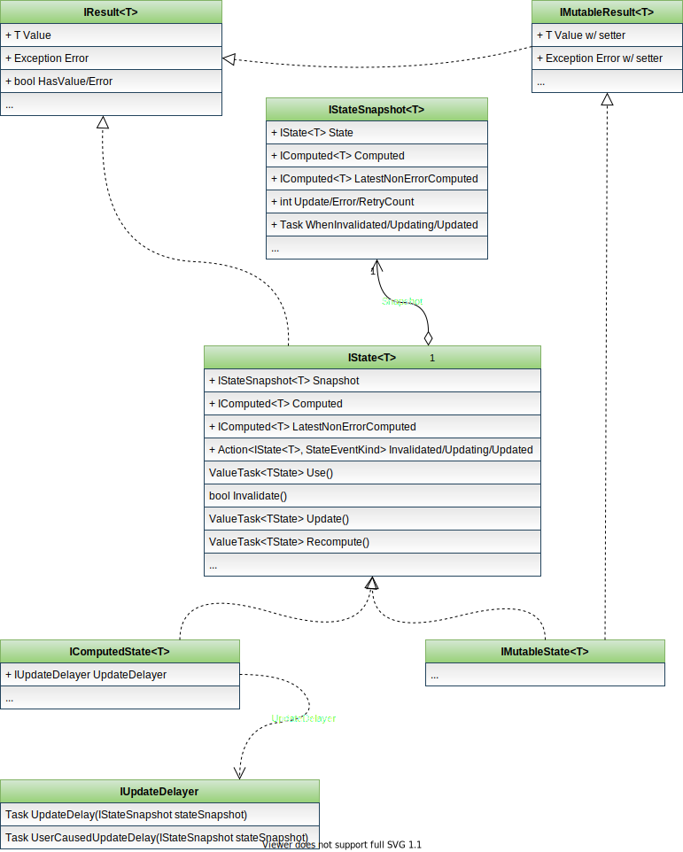

# Part 3: State: IState&lt;T&gt; and Its flavors

Video covering this part (a bit outdated due to API changes):

[](https://youtu.be/9maSiI29kvI)

You already know two key concepts of Fusion:

1. **Compute Services** allow to write functions that compute everything just
   once and keep the result cached till the moment it either stopped being used,
   or one of its dependencies (a similar output) gets invalidated.
2. `Computed<T>` &ndash; an abstraction that's actually responsible for
   tracking all these dependencies.

The last missing piece of a puzzle is `IState<T>`, or simply speaking,
a "state". If you used Knockout.js or MobX earlier, state would correspond
to their versions of computed values - i.e. in fact, state simply tracks
the most recent version of some `Computed<T>`.

Ok, probably it's not quite clear what I just said, but remember that:

- Computed values are immutable - once created in `Computing` state,
  they turn `Consistent` first, but eventually become `Inconsistent`.
- The rules of the game set in such a way that, if we ignore `Computing`
  state, there can be only one `Consistent` version of a computed value corresponding to the same computation at any given moment.
  Every other version (in fact, the older one) will be `Inconsistent`.

So `IState<T>` is what "tracks" the most up-to-date version. There are two implementations of `IState<T>`:

- `IMutableState<T>` is, in fact, a variable with `Computed<T>` envelope.
  It's `Computed` property returns always-consistent computed, which gets
  replaced once the `IMutableState.Value` (or `Error`, etc.) is set;
  the old computed gets invalidated.
  If you have such a state, you can use it in one of compute methods
  to make its output dependent on it, or similarly use it in other
  computed state. But describing client-side state of UI components (e.g.
  a value entered into a search box) is its most frequent use case.
- `IComputedState<T>` - a computed state that triggers its own recomputation
  (update) after the invalidation. And if you think what are the "levers"
  it might have, you'll quickly conclude the only option it needs to control
  is a delay between the invalidation and the update. And that's exactly
  what it offers - its `UpdateDelayer` property references `IUpdateDelayer`,
  which implements the delay. Moreover, any `IUpdateDelayer` also supports
  cancellation of any active delays.

Let's summarize all of this in a single table:


And finally, states have a few extra properties:

- Similarly to `IEnumerable<T>` \ `IEnumerable`, there are typed
  and untyped versions of any `IState` interface.
- Similarly to `Computed<T>`, any state implements `IResult<T>`
  by forwarding all the calls to its `Computed` property.
- `IMutableState<T>` also implements `IMutableResult<T>`
- Any state has `Snapshot` property of `IStateSnapshot<T>` type.
  This property is updated atomically and returns an immutable object describing the current "state" of the `IState<T>`. If you'll
  ever need a "consistent" view of the state, `Snapshot` is
  the way to get it. A good example of where you'd need it would be
  this one:
  - You read `state.HasValue` first, it returns `true`
  - But a subsequent attempt to read `state.Value` fails because
    the state was updated right in between these two reads.
  - Doing the same via `Snapshot.Computed` property ensures
    this can't happen.
- Both `IState<T>` and `IStateSnapshot<T>` expose
  `LastNonErrorValue` and `LatestNonErrorValueComputed` properties - they
  allow to access the last valid `Value` and its `Computed<T>`
  exposed by the state. In other words, when state exposes
  an `Error`, `LastNonErrorValue` still exposes the previous `Value`.
  This feature is quite handy when you need to access both
  the last "correct" value (to e.g. bind it to the UI)
  and the newly observed `Error` (to display it separately).

The interface diagram for `IState<T>` and its "friends"
(arrows with no label show inheritance):



## Constructing States

There are two ways of doing this:

1. Using `IStateFactory`. Any `IServiceProvider` configured to use
   Fusion (with `.AddFusionCore()`) should resolve it.
2. Subclassing `MutableState<T>`, `ComputedState<T>`, etc.
   and either creating its instance manually, or registering
   a new type as a service via `.AddState(...)` method and
   resolving it via `IServiceProvider`.

Normally you need just the first option.
The remaining part of this document relies on it.

## Mutable State

Time to write some code! We'll be using the same "stub"
with `CounterService` and `CreateServices` here:

``` cs --editable false --region Part03_CounterService --source-file Part03.cs
public class CounterService : IComputeService
{
    private readonly ConcurrentDictionary<string, int> _counters = new ConcurrentDictionary<string, int>();

    [ComputeMethod]
    public virtual async Task<int> Get(string key)
    {
        WriteLine($"{nameof(Get)}({key})");
        return _counters.TryGetValue(key, out var value) ? value : 0;
    }

    public void Increment(string key)
    {
        WriteLine($"{nameof(Increment)}({key})");
        _counters.AddOrUpdate(key, k => 1, (k, v) => v + 1);
        using (Computed.Invalidate())
            _ = Get(key);
    }
}

public static IServiceProvider CreateServices()
{
    var services = new ServiceCollection();
    services.AddFusion().AddService<CounterService>();
    return services.BuildServiceProvider();
}
```

Here is how you use `MutableState<T>`:

``` cs --region Part03_MutableState --source-file Part03.cs
var services = CreateServices();
var stateFactory = services.StateFactory();
var state = stateFactory.NewMutable<int>(1);
var computed = state.Computed;
WriteLine($"Value: {state.Value}, Computed: {state.Computed}");
state.Value = 2;
WriteLine($"Value: {state.Value}, Computed: {state.Computed}");
WriteLine($"Old computed: {computed}"); // Should be invalidated
```

The output:

```text
Value: 1, Computed: StateBoundComputed`1(MutableState`1(#63646052) @2AULKFZxjG, State: Consistent)
Value: 2, Computed: StateBoundComputed`1(MutableState`1(#63646052) @2AULKFZxlK, State: Consistent)
Old computed: StateBoundComputed`1(MutableState`1(#63646052) @2AULKFZxjG, State: Invalidated)
```

Note that:

* `services.GetStateFactory()` is a shortcut for `services.GetRequiredService<IStateFactory>()`
* Old `computed` is in `Invalidated` state at the last line.

Let's look at error handling example:

``` cs --region Part03_MutableStateError --source-file Part03.cs
var services = CreateServices();
var stateFactory = services.StateFactory();
var state = stateFactory.NewMutable<int>();
WriteLine($"Value: {state.Value}, Computed: {state.Computed}");
WriteLine("Setting state.Error.");
state.Error = new ApplicationException("Just a test");
try
{
    WriteLine($"Value: {state.Value}, Computed: {state.Computed}");
}
catch (ApplicationException)
{
    WriteLine($"Error: {state.Error.GetType()}, Computed: {state.Computed}");
}
WriteLine($"LastNonErrorValue: {state.LastNonErrorValue}");
WriteLine($"Snapshot.LastNonErrorComputed: {state.Snapshot.LastNonErrorComputed}");
```

The output:

```text
Value: 0, Computed: StateBoundComputed`1(MutableState`1(#63646052) @caJUviqcf, State: Consistent)
Setting state.Error.
Error: System.ApplicationException, Computed: StateBoundComputed`1(MutableState`1(#63646052) @caJUviqej, State: Consistent)
LastNonErrorValue: 0
Snapshot.LastNonErrorComputed: StateBoundComputed`1(MutableState`1(#63646052) @caJUviqcf, State: Invalidated)
```

As you see, `Value` property throws an exception here &ndash;
as per `IResult<T>` contract, it re-throws an exception stored
in `Error`.

The last "valid" value is still available via `LastNonErrorValue` property;
similarly, the last "valid" computed instance is still available
via `LatestNonErrorValueComputed`.

## Computed State

Let's play with `IComputedState<T>` now:

``` cs --region Part03_LiveState --source-file Part03.cs
var services = CreateServices();
var counters = services.GetRequiredService<CounterService>();
var stateFactory = services.StateFactory();
WriteLine("Creating state.");
using var state = stateFactory.NewComputed(
    new ComputedState<string>.Options() {
        UpdateDelayer = FixedDelayer.Get(1), // 1 second update delay
        EventConfigurator = state1 => {
            // A shortcut to attach 3 event handlers: Invalidated, Updating, Updated
            state1.AddEventHandler(StateEventKind.All,
                (s, e) => WriteLine($"{DateTime.Now}: {e}, Value: {s.Value}, Computed: {s.Computed}"));
        },
    },
    async (state, cancellationToken) =>
    {
        var counter = await counters.Get("a");
        return $"counters.Get(a) -> {counter}";
    });
WriteLine("Before state.Update(false).");
await state.Update(); // Ensures the state gets up-to-date value
WriteLine("After state.Update(false).");
counters.Increment("a");
await Task.Delay(2000);
WriteLine($"Value: {state.Value}, Computed: {state.Computed}");
```

The output:

```text


Creating state.
10/2/2020 6:26:04 AM: Updated, Value: , Computed: StateBoundComputed`1(FuncLiveState`1(#66697461) @26, State: Consistent)
10/2/2020 6:26:04 AM: Invalidated, Value: , Computed: StateBoundComputed`1(FuncLiveState`1(#66697461) @26, State: Invalidated)
Before state.Update(false).
10/2/2020 6:26:04 AM: Updating, Value: , Computed: StateBoundComputed`1(FuncLiveState`1(#66697461) @26, State: Invalidated)
Get(a)
10/2/2020 6:26:04 AM: Updated, Value: counters.Get(a) -> 0, Computed: StateBoundComputed`1(FuncLiveState`1(#66697461) @4a, State: Consistent)
After state.Update(false).
Increment(a)
10/2/2020 6:26:04 AM: Invalidated, Value: counters.Get(a) -> 0, Computed: StateBoundComputed`1(FuncLiveState`1(#66697461) @4a, State: Invalidated)
10/2/2020 6:26:05 AM: Updating, Value: counters.Get(a) -> 0, Computed: StateBoundComputed`1(FuncLiveState`1(#66697461) @4a, State: Invalidated)
Get(a)
10/2/2020 6:26:05 AM: Updated, Value: counters.Get(a) -> 1, Computed: StateBoundComputed`1(FuncLiveState`1(#66697461) @29, State: Consistent)
Value: counters.Get(a) -> 1, Computed: StateBoundComputed`1(FuncLiveState`1(#66697461) @29, State: Consistent)
```

Some observations:

* New `IComputedState<T>` initially gets a default value
  (the first "Updated: ..." output)
* This value gets invalidated immediately (i.e. while
  `stateFactory.NewLive<T>(...)` runs)
* `aCounterState.Update(false)` triggers its update.
  Interestingly, though, that this update will anyway happen
  immediately by default - the very first update delay is
  always zero. You can check this by replacing the line
  with `Update(false)` to `await Task.Delay(100)`
* Later the invalidation happens right after the value
  state depends on gets invalidated.
* But the update follows in 1 second - i.e. as it was
  specified in options we've provided.

#### [Next: Part 4 &raquo;](./Part04.md) | [Tutorial Home](./README.md)
