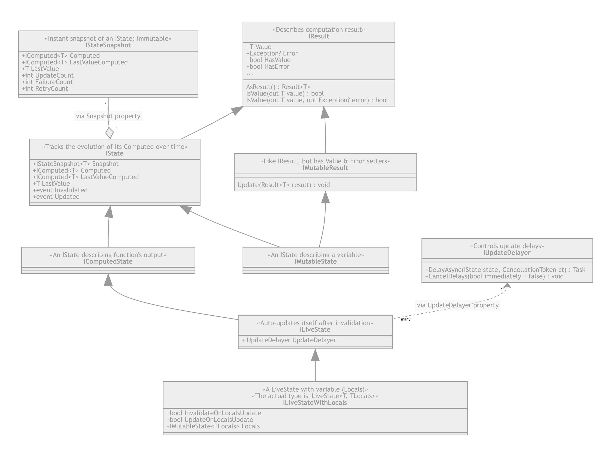

# Part 2: State: IState&lt;T&gt; and its flavors

Video covering this part: **TBD**.

You already know two key concepts of Fusion:
1. **Compute services** allow to write functions that compute everything just
   once and keep the result cached till the moment it either stopped being used,
   or one of its dependencies (a similar output) gets invalidated.
2. `IComputed<T>` &ndash; an abstraction that's actually responsible for 
   tracking all these dependencies.

The last missing piece of a puzzle is `IState<T>`, or simply speaking, 
a "state". If you used Knockout.js or MobX earlier, state would correspond
to their versions of computed values - i.e. in fact, state simply tracks
the most recent version of some `IComputed<T>`.

Ok, probably it's not quite clear what I just said, but remember that:
- Computed values are immutable - once created in `Computing` state,
  they turn `Consistent` first, but eventually become `Inconsistent`.
- The rules of the game set in such a way that, if we ignore `Computing`
  state, there can be only one `Consistent` version of a computed value corresponding to the same computation at any given moment. 
  Every other version (in fact, the older one) will be `Inconsistent`.

So `IState<T>` is what "tracks" the most up-to-date version. There are a few flavors of it behaving slightly differently:
- `IMutableState<T>` is, in fact, a variable that got `IComputed<T>` envelope.
  It's `Computed` property returns always-consistent computed, which gets
  replaced once the `IMutableState.Value` (or `Error`, etc.) is set;
  the old computed gets invalidated. 
  If you have such a state, you can use it in one of compute methods
  to make its output dependent on it, or similarly use it in other 
  computed state. But describing client-side state of UI components (e.g. 
  a value entered into a search box) is its most frequent use case.
- `IComputedState<T>` is ~ the opposite of mutable state, i.e. a state
  that's computed rather than set externally. There is an abstract base
  class corresponding to this interface, but all non-abstract 
  implementations of it also implement...
- `ILiveState<T>` - a computed state that triggers its own recomputation 
  (update) after the invalidation. And if you think what are the "levers"
  it might have, you'll quickly conclude the only option it needs to control
  is a delay between the invalidation and the update. And that's exactly
  what it offers - its `UpdateDelayer` property references `IUpdateDelayer`,
  which implements the delay. Moreover, any `IUpdateDelayer` also supports
  cancellation of any active delays.
- Finally, there is `ILiveState<T, TLocals>` - a convenience interface
  inheriting from `ILiveState<T>`, but also having `Locals` property of
  `IMutableState<TLocals>` type. In other words, that's a live state
  that's always "dependent" on its `Locals` variable, so once it changes,
  the live state gets invalidated (and by default, gets updated immediately,
  if it's due to `Locals` update).

Let's summarize all of this in a single table:

---

| Type                                   | IMutableState<T> | IComputedState<T> | ILiveState<T>         | ILiveState<T, TLocals>                                                     |
|----------------------------------------|------------------|-------------------|-----------------------|----------------------------------------------------------------------------|
| Auto-update behavior                   | On Update        | Undefined         | On invalidation       | On invalidation                                                            |
| Auto-update delay                      | 0                | Undefined         | `UpdateDelayer` decides | `UpdateDelayer` decides; `0` on setting `Locals` if `UpdateOnLocalsUpdate == true` |
| Has `IMutableState<TLocals> Locals`?     | No               | Undefined         | No                    | Yes                                                                        |
| `state.Computed` is always consistent?   | Yes              | Undefined         | No                    | No                                                                         |
| `state.Value/Error` can be set manually? | Yes              | No                | No                    | No                                                                         |

---

And finally, states have a few extra properties:
- Similarly to `IEnumerable<T>` \ `IEnumerable`, there are typed
  and untyped versions of any `IState` interface.
- Any state implements `IResult<T>`
- `IMutableState<T>` implements `IMutableResult<T>`
- Any state has `Snapshot` property of `IStateSnapshot<T>` type.
  This property is updated atomically and returns an immutable object describing the current "state" of the `IState<T>`. If you'll
  ever need a "consistent" view of the state, `Snapshot` is
  the way to get it. A good example of where you'd need it would be
  this one: 
  - You read `state.HasValue` first, it returns `true`
  - But a subsequent attempt to read `state.Value` fails because
    the state was updated right in between these two reads.
  - Doing the same via `Snapshot.Computed` property ensures 
    this can't happen.
- Both `IState<T>` and `IStateSnapshot<T>` expose
  `LastValue` and `LastValueComputed` properties - they
  allow to access the last valid `Value` and its `IComputed<T>` 
  exposed by the state. In other words, when state exposes
  an `Error`, `LastValue` still exposes the previous `Value`.
  This feature is quite handy when you need to access both 
  the last "correct" value (to e.g. bind it to the UI) 
  and the newly observed `Error` (to display it separately).

The diagram describing all of this:

> Note that `<T>` absents on the diagram due to limitations of 
> [Mermaid.js](https://mermaid-js.github.io/mermaid/#/), 
> even though in reality all these interfaces have this parameter.

## Constructing States ##

There are two ways of doing this:
1. Using `IStateFactory`. Any `IServiceProvider` configured to use
   Fusion (with `.AddFusionCore()`) should resolve it.
2. By creating descendants of `MutableState<T>`, `LiveState<T>`, etc.
   and registering them in your service container via `.AddState(...)`
   method.
   
Normally you need just the first option, and here we'll going to 
cover this part. Time to write some code!

#### [Next: Part 4 &raquo;](./Part04.md) | [Tutorial Home](./README.md)

