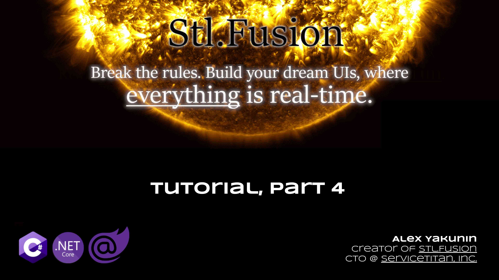
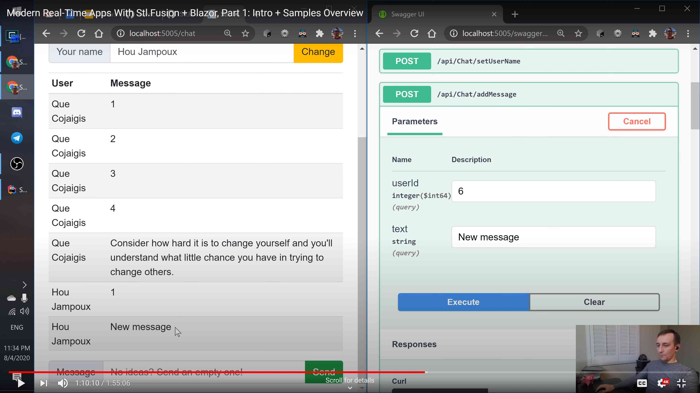

# Part 4: Compute Service Clients

Video covering this part:

[](https://youtu.be/_wFhi11Eb0o)

Compute Service Clients are remote proxies of Compute Services that take
the behavior of `Computed<T>` into account to be more efficient
than identical web API clients.

Namely:

- They similarly back the result to any call with `Computed<T>` that mimics
  matching `Computed<T>` on the server side. So such client-side proxies
  can be used in other client-side Compute Services - and as you might guess,
  invalidation of a server-side dependency will trigger invalidation of
  its client-side replica (`Computed<T>` too), which in turn will invalidate
  every client-side computed that uses it.
- They similarly cache consistent replicas. In other words, Compute Service client
  won't make a remote call in case a *consistent* replica is still available.
  So it's exactly the same behavior as for Compute Services if we replace
  the "computation" with "RPC call".

Compute Service clients communicate with the server over WebSocket channel -
internally they use `Stl.Rpc` infrastructure to make such calls, as well as
to receive notifications about server-side invalidations.

Resilience (reconnect on disconnect, refresh of every replica of `Computed<T>` on reconnect, etc.)
is bundled - `Stl.Rpc` and `Stl.Fusion.Client` take care of that.

Finally, Compute Service clients are just interfaces. They typically
declare every method of a Compute Service they "mimic".
The interfaces are needed solely to describe how method calls should be
mapped to corresponding HTTP endpoints.

Ok, let's write some code to learn how it works. Unfortunately this time the amount of
code is going to explode a bit - that's mostly due to the fact we'll need a web server
hosting Compute Service itself, a controller publishing its invocable endpoints, etc.

1. Common interface (don't run this code yet):

``` cs --editable false --region Part04_CommonServices --source-file Part04.cs
// Ideally, we want Compute Service client to be exactly the same as corresponding
// Compute Service. A good way to enforce this is to expose an interface
// that should be implemented by Compute Service + tell Fusion to "expose"
// the client via the same interface.
public interface ICounterService : IComputeService
{
    [ComputeMethod]
    Task<int> Get(string key, CancellationToken cancellationToken = default);
    Task Increment(string key, CancellationToken cancellationToken = default);
    Task SetOffset(int offset, CancellationToken cancellationToken = default);
}
```

2. Web host services (don't run this code yet):

``` cs --editable false --region Part04_HostServices --source-file Part04.cs
public class CounterService : ICounterService
{
    private readonly ConcurrentDictionary<string, int> _counters = new ConcurrentDictionary<string, int>();
    private readonly IMutableState<int> _offset;

    public CounterService(IStateFactory stateFactory)
        => _offset = stateFactory.NewMutable<int>();

    [ComputeMethod] // Optional: this attribute is inherited from interface
    public virtual async Task<int> Get(string key, CancellationToken cancellationToken = default)
    {
        WriteLine($"{nameof(Get)}({key})");
        var offset = await _offset.Use(cancellationToken);
        return offset + (_counters.TryGetValue(key, out var value) ? value : 0);
    }

    public Task Increment(string key, CancellationToken cancellationToken = default)
    {
        WriteLine($"{nameof(Increment)}({key})");
        _counters.AddOrUpdate(key, k => 1, (k, v) => v + 1);
        using (Computed.Invalidate())
            _ = Get(key, default);
        return Task.CompletedTask;
    }

    public Task SetOffset(int offset, CancellationToken cancellationToken = default)
    {
        WriteLine($"{nameof(SetOffset)}({offset})");
        _offset.Value = offset;
        return Task.CompletedTask;
    }
}
```

3. `CreateHost` and `CreateClientServices` methods (don't run this code yet):

``` cs --editable false --region Part04_CreateXxx --source-file Part04.cs
public static IHost CreateHost()
{
    var builder = Host.CreateDefaultBuilder();
    builder.ConfigureHostConfiguration(cfg =>
        cfg.AddInMemoryCollection(new Dictionary<string, string>() { { "Environment", "Development" } }));
    builder.ConfigureLogging(logging =>
        logging.ClearProviders().SetMinimumLevel(LogLevel.Information).AddDebug());
    builder.ConfigureServices((b, services) =>
    {
        var fusion = services.AddFusion();
        fusion.AddWebServer();
        // Registering Compute Service
        fusion.AddService<ICounterService, CounterService>();
    });
    builder.ConfigureWebHost(b =>
    {
        b.UseKestrel();
        b.UseUrls("http://localhost:50050/");
        b.Configure((ctx, app) => {
            app.UseWebSockets();
            app.UseRouting();
            app.UseEndpoints(endpoints => {
                endpoints.MapRpcWebSocketServer();
            });
        });
    });
    return builder.Build();
}

public static IServiceProvider CreateClientServices()
{
    var services = new ServiceCollection();
    var baseUri = new Uri($"http://localhost:50050/");

    var fusion = services.AddFusion();
    fusion.Rpc.AddWebSocketClient(baseUri);
    fusion.AddClient<ICounterService>();

    return services.BuildServiceProvider();
}
```

And finally, we're ready to try our Compute Service client:

``` cs --region Part04_ReplicaService --source-file Part04.cs
using var host = CreateHost();
await host.StartAsync();
WriteLine("Host started.");

using var stopCts = new CancellationTokenSource();
var cancellationToken = stopCts.Token;

async Task Watch<T>(string name, Computed<T> computed)
{
    for (; ; )
    {
        WriteLine($"{name}: {computed.Value}, {computed}");
        await computed.WhenInvalidated(cancellationToken);
        WriteLine($"{name}: {computed.Value}, {computed}");
        computed = await computed.Update(cancellationToken);
    }
}

var services = CreateClientServices();
var counters = services.GetRequiredService<ICounterService>();
var aComputed = await Computed.Capture(() => counters.Get("a"));
_ = Task.Run(() => Watch(nameof(aComputed), aComputed));
var bComputed = await Computed.Capture(() => counters.Get("b"));
_ = Task.Run(() => Watch(nameof(bComputed), bComputed));

await Task.Delay(200);
await counters.Increment("a");
await Task.Delay(200);
await counters.SetOffset(10);
await Task.Delay(200);

stopCts.Cancel();
await host.StopAsync();
```

The output:

```text
Host started.
CounterController.Get(a)
Get(a)
aComputed: 0, ReplicaClientComputed`1(Intercepted:ICounterServiceProxy.Get(a, System.Threading.CancellationToken) @4f, State: Consistent)
CounterController.Get(b)
Get(b)
bComputed: 0, ReplicaClientComputed`1(Intercepted:ICounterServiceProxy.Get(b, System.Threading.CancellationToken) @6j, State: Consistent)
CounterController.Increment(a)
Increment(a)
aComputed: 0, ReplicaClientComputed`1(Intercepted:ICounterServiceProxy.Get(a, System.Threading.CancellationToken) @4f, State: Invalidated)
Get(a)
aComputed: 1, ReplicaClientComputed`1(Intercepted:ICounterServiceProxy.Get(a, System.Threading.CancellationToken) @2m, State: Consistent)
CounterController.SetOffset(10)
SetOffset(10)
bComputed: 0, ReplicaClientComputed`1(Intercepted:ICounterServiceProxy.Get(b, System.Threading.CancellationToken) @6j, State: Invalidated)
aComputed: 1, ReplicaClientComputed`1(Intercepted:ICounterServiceProxy.Get(a, System.Threading.CancellationToken) @2m, State: Invalidated)
Get(a)
Get(b)
aComputed: 11, ReplicaClientComputed`1(Intercepted:ICounterServiceProxy.Get(a, System.Threading.CancellationToken) @2n, State: Consistent)
bComputed: 10, ReplicaClientComputed`1(Intercepted:ICounterServiceProxy.Get(b, System.Threading.CancellationToken) @29, State: Consistent)
```

So Compute Service client does its job &ndash; it perfectly mimics the underlying Compute Service!

Notice that `CounterController` methods are invoked just once for a given set of arguments &ndash;
that's because while some `Computed<T>` replica is consistent, Compute Service client just uses it
and completely eliminates the RPC call.

[](https://www.youtube.com/watch?v=jYVe5yd0xuQ&t=4173s)

Now, let's show that client-side `ComputedState<T>` can use Compute Service client
to "observe" the output of server-side Compute Service. The code below
is almost the same as you saw in previous part showcasing `ComputedState<T>`,
but it uses Compute Service client instead of Computed Service.

``` cs --region Part04_LiveStateFromReplica --source-file Part04.cs
using var host = CreateHost();
await host.StartAsync();
WriteLine("Host started.");

var services = CreateClientServices();
var counters = services.GetRequiredService<ICounterService>();
var stateFactory = services.StateFactory();
using var state = stateFactory.NewComputed(
    new ComputedState<string>.Options() {
        UpdateDelayer = FixedDelayer.Get(1), // 1 second update delay
        EventConfigurator = state1 => {
            // A shortcut to attach 3 event handlers: Invalidated, Updating, Updated
            state1.AddEventHandler(StateEventKind.All,
                (s, e) => WriteLine($"{DateTime.Now}: {e}, Value: {s.Value}, Computed: {s.Computed}"));
        },
    },
    async (state, cancellationToken) =>
    {
        var counter = await counters.Get("a", cancellationToken);
        return $"counters.Get(a) -> {counter}";
    });
await state.Update(); // Ensures the state gets up-to-date value
await counters.Increment("a");
await Task.Delay(2000);
await counters.SetOffset(10);
await Task.Delay(2000);

await host.StopAsync();
```

The output:

```text
Host started.
10/2/2020 6:27:48 AM: Updated, Value: , Computed: StateBoundComputed`1(FuncLiveState`1(#38338487) @26, State: Consistent)
10/2/2020 6:27:48 AM: Invalidated, Value: , Computed: StateBoundComputed`1(FuncLiveState`1(#38338487) @26, State: Invalidated)
10/2/2020 6:27:48 AM: Updating, Value: , Computed: StateBoundComputed`1(FuncLiveState`1(#38338487) @26, State: Invalidated)
CounterController.Get(a)
Get(a)
10/2/2020 6:27:48 AM: Updated, Value: counters.Get(a) -> 0, Computed: StateBoundComputed`1(FuncLiveState`1(#38338487) @4a, State: Consistent)
CounterController.Increment(a)
Increment(a)
10/2/2020 6:27:48 AM: Invalidated, Value: counters.Get(a) -> 0, Computed: StateBoundComputed`1(FuncLiveState`1(#38338487) @4a, State: Invalidated)
10/2/2020 6:27:49 AM: Updating, Value: counters.Get(a) -> 0, Computed: StateBoundComputed`1(FuncLiveState`1(#38338487) @4a, State: Invalidated)
Get(a)
10/2/2020 6:27:50 AM: Updated, Value: counters.Get(a) -> 1, Computed: StateBoundComputed`1(FuncLiveState`1(#38338487) @6h, State: Consistent)
CounterController.SetOffset(10)
SetOffset(10)
10/2/2020 6:27:50 AM: Invalidated, Value: counters.Get(a) -> 1, Computed: StateBoundComputed`1(FuncLiveState`1(#38338487) @6h, State: Invalidated)
10/2/2020 6:27:51 AM: Updating, Value: counters.Get(a) -> 1, Computed: StateBoundComputed`1(FuncLiveState`1(#38338487) @6h, State: Invalidated)
Get(a)
10/2/2020 6:27:51 AM: Updated, Value: counters.Get(a) -> 11, Computed: StateBoundComputed`1(FuncLiveState`1(#38338487) @ap, State: Consistent)
10/2/2020 6:27:52 AM: Invalidated, Value: counters.Get(a) -> 11, Computed: StateBoundComputed`1(FuncLiveState`1(#38338487) @ap, State: Invalidated)
```

As you might guess, this is exactly the logic out Blazor samples use to update
the UI in real time. Moreover, we similarly use the same interface both for
Compute Services and their clients - and that's precisely what allows
use to have the same UI components working in WASM and Server-Side Blazor mode:

- When UI components are rendered on the server side, they pick server-side
  Compute Services from host's `IServiceProvider` as implementation of
  `IWhateverService`. Replicas aren't needed there, because everything is local.
- And when the same UI components are rendered on the client, they pick
  Compute Service client as `IWhateverService` from the client-side IoC container,
  and that's what makes any `IState<T>` to update in real time there, which
  in turn makes UI components to re-render.

**That's pretty much it - now you learned all key features of Fusion.**
There are details, of course, and the rest of the tutorial is mostly about them.

#### [Next: Part 5 &raquo;](./Part05.md) | [Tutorial Home](./README.md)
